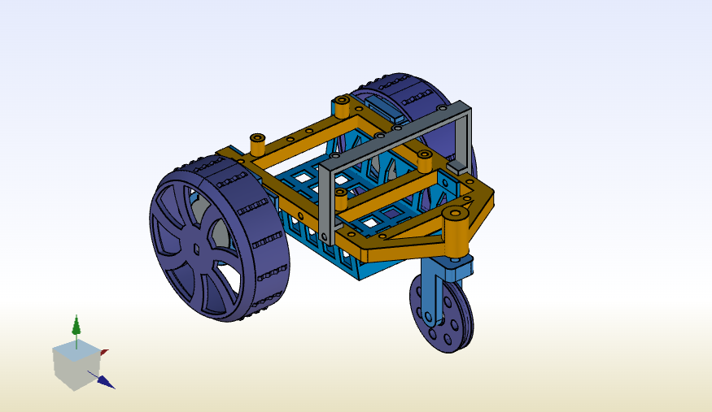
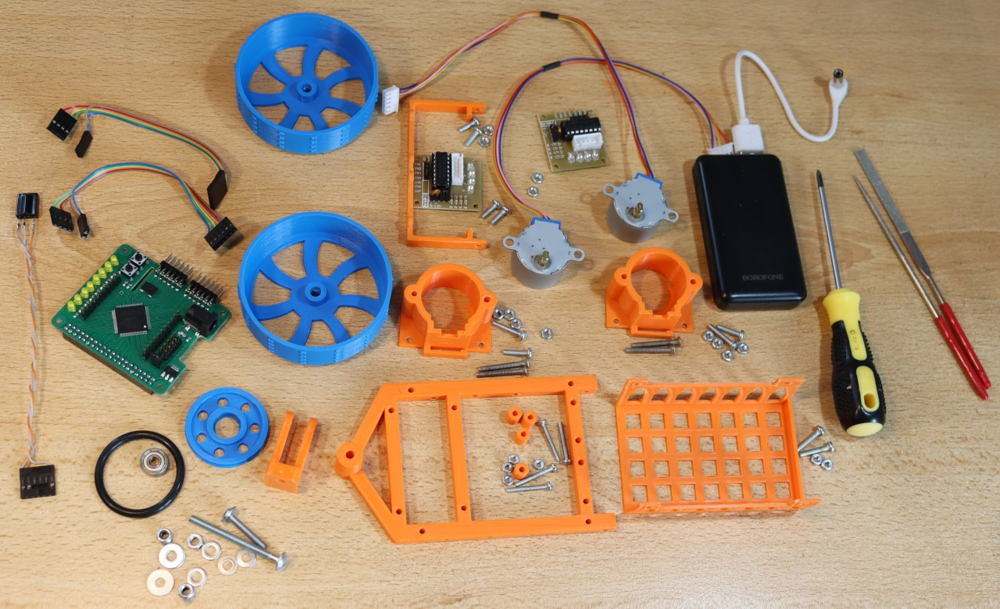
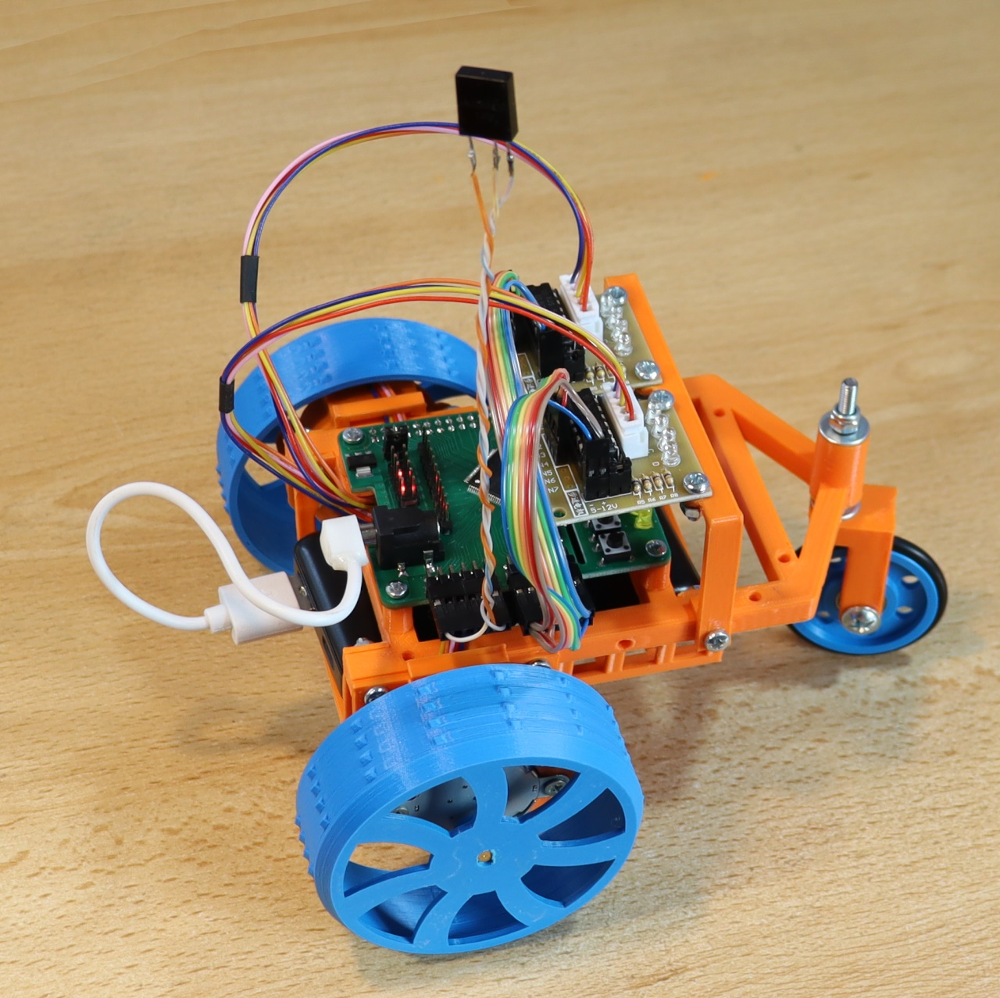

# MarsohodChassis

FreeCAD 1.0 3D Model of Simple Marsohod chassis.
Parts 3D printable. All parts are here:

Assembly of chassis is very easy and described here https://marsohod.org/home
After assembly You get Marsohod BOT:

There are some project for this machinery:

1) Drive Marsohod by IR-control https://marsohod.org/projects/proekt-ma3128/451-marshod-ir-control

